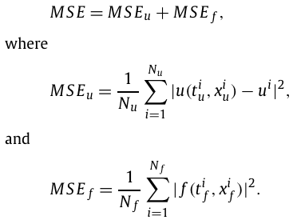
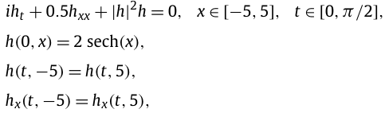
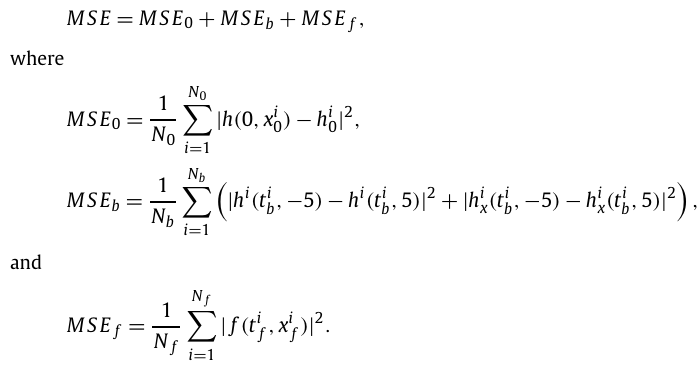

# PyTorch version of PINNs examples
Data is copied from the original repo of [PINNs](https://github.com/maziarraissi/PINNs)

## Burgers Equation
For a given field `u(x,t)` and diffusion coefficient `nu`, the general form of the equation in 1D is: 

### Data
The data includes:
1. boundary data, i.e., `u(x=-1,t)`, `u(x=1,t)`, and `u(x, t=0)`
2. collocation points, sampled within the boundary.

### Loss
The loss, corresponding to the data, has two terms:
1. MSE_u: the boundary loss, loss between ground truth value and model(boundary_points).
2. MSE_f: the PDE loss.

## Schrodinger Equation
The non-linear Schrodinger equation along with periodic boundary conditions is given by 
where `h(t,x)` is the complex-valued solution.

### Data
The data includes:
1. initial data, i.e., `h(0,x)`.
2. boundary condition, i.e., `h(t,5)` and `h(t,-5)`.
3. collocation points, sampled within the boundaries.

### Loss
The loss, corresponding to the data, has three terms:
1. MSE_0: the initial data loss.
2. MSE_b: the boundary loss.
3. MSE_F: the PDE loss.
