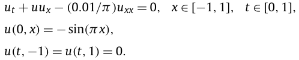

# PyTorch version of PINNs examples
Data is copied from the original repo of [PINNs](https://github.com/maziarraissi/PINNs)

## Burgers Equation
For a given field `u(x,t)` and diffusion coefficient `nu`, the general form of the equation in 1D is: 

### data:
The data includes boundary data and collocation points. The loss of boundary data and collocation points are different.